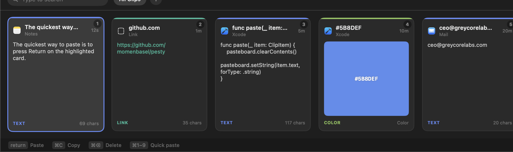

<div align="center">


# Pesty

**A free, open-source clipboard manager for macOS — inspired by [Paste](https://pasteapp.io).**

Your clipboard history as a beautiful, color-coded strip that slides up from the bottom of your screen.

[](https://github.com/momenbasel/pesty/releases/latest)
[](LICENSE)




</div>

## What is Pesty?

Pesty keeps a history of everything you copy and lets you get it back instantly. Hit a global hotkey, the strip slides up, you pick a clip with the arrow keys (or `⌘1`–`⌘9`), press `return`, and it pastes straight into whatever app you were in.

It is a faithful, native reimplementation of the Paste experience — built in **Swift + SwiftUI**, with **zero third-party dependencies**, fully **signed and notarized** by Apple, and **free forever**.

## Features

- **Slide-up strip** — full-width, translucent bar that animates up from the bottom of the active screen.
- **Color-coded cards** — every clip is a card showing the source app icon, an editable title, when it was copied, a preview, and a footer label (`TEXT`, `LINK`, `IMAGE`, `FILE`, `COLOR`, `RICH TEXT`) with a character count.
- **All content types** — plain text, rich text, links, images, files, and colors.
- **Pinboards** — save clips you reuse into named, color-tagged collections that never expire.
- **Instant search** — start typing to filter your whole history.
- **Keyboard-first** — arrow keys to move, `return` to paste, `⌘1`–`⌘9` to quick-paste, `⌘⌫` to delete, `esc` to close.
- **Paste directly** — drops the clip into the app you were using, no manual `⌘V` needed.
- **Privacy-aware** — ignores clips marked concealed by password managers.
- **Menu-bar app** — runs quietly as a menu-bar item, optional launch at login.
- **Native & light** — a single universal `.app`, no Electron, no background web stack.

## Install

### Homebrew (recommended)

```bash
brew install --cask momenbasel/pesty/pesty
```

### Direct download

1. Download `Pesty-x.y.z.dmg` from the [latest release](https://github.com/momenbasel/pesty/releases/latest).
2. Open the DMG and drag **Pesty** to **Applications**.
3. Launch Pesty. It lives in your menu bar.

The build is signed with a Developer ID and notarized by Apple, so it opens without Gatekeeper warnings.

## First run

1. Press **`⌘⇧V`** (the default shortcut) to open the strip.
2. The first time you paste, macOS asks for **Accessibility** permission — grant it so Pesty can paste into other apps. You can change this anytime in **Settings → Permissions**.

## Keyboard shortcuts

| Key | Action |
| --- | --- |
| `⌘⇧V` | Show / hide the strip (configurable) |
| `←` `→` `↑` `↓` | Move selection |
| `return` | Paste selected clip |
| `⌘1`–`⌘9` | Quick-paste the Nth clip |
| `⌘⌫` | Delete selected clip |
| type anything | Search |
| `esc` | Clear search, then close |

## Build from source

Requires macOS 14+ and Xcode 16+ (Swift 6).

```bash
git clone https://github.com/momenbasel/pesty.git
cd pesty
swift run            # run in place
# or build a distributable .app:
VERSION=1.0.0 BUILD=1 ./scripts/build_app.sh
open packaging/Pesty.app
```

To produce a signed + notarized DMG (needs a Developer ID cert and an App Store Connect API key):

```bash
SIGN_IDENTITY="Developer ID Application: Your Name (TEAMID)" \
ASC_KEY="$HOME/.appstoreconnect/private_keys/AuthKey_XXXX.p8" \
ASC_KEY_ID="XXXX" ASC_ISSUER="<issuer-uuid>" \
./scripts/release_build.sh
```

## Project structure

```
Sources/Pesty/
  Main.swift            entry point
  AppController.swift   app delegate, hotkey + menu-bar wiring, paste flow
  Models/               ClipItem, ClipType, Pinboard
  Store/                ClipboardStore (history, pinboards, persistence)
  Monitor/              ClipboardMonitor (pasteboard polling), PasteService (⌘V injection)
  Hotkey/               HotKeyCenter (Carbon global hotkey)
  UI/                   BarView, ClipCardView, PinboardTabs, the sliding panel
  Settings/             Settings store + preferences window + hotkey recorder
  Util/                 icons, color hex, visual-effect view, launch-at-login
scripts/                build, icon, sign + notarize
packaging/              Info.plist, entitlements, generated artifacts
```

## How it compares to Paste

Pesty reimplements the parts of Paste people use every day — the strip, color-coded cards, pinboards, search, and keyboard-driven pasting. Paste is a polished commercial product with iCloud sync across iPhone/iPad/Mac, unlimited history tiers, and years of refinement. Pesty is a free, native, open-source take on the same core idea. If you love Paste, [buy it](https://pasteapp.io) — it's excellent. Pesty exists for people who want a free, hackable alternative.

## Contributing

PRs welcome — see [CONTRIBUTING.md](CONTRIBUTING.md). Good first issues: large preview pane, drag-and-drop out of cards, strip resize handle, iCloud/file sync, more content-type renderers.

## License

[MIT](LICENSE) © 2026 Moamen Basel.

## Disclaimer

Pesty is an independent project and is **not affiliated with, endorsed by, or connected to** Paste or its makers (Wonder Warp / FIPLAB). "Paste" is referenced only to describe the inspiration. All trademarks belong to their respective owners.
